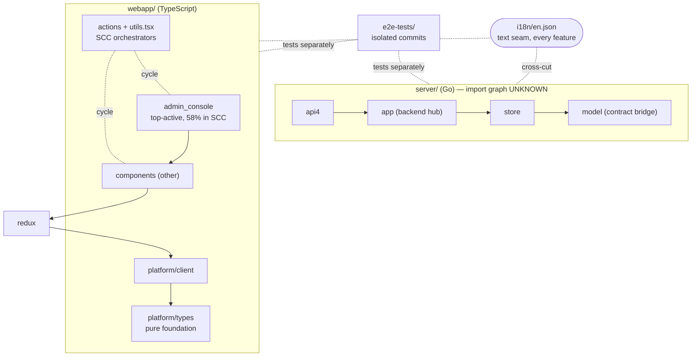

#Research Objective:
Analysis of the configuration surface stability starting from the entry file `server/public/model/config.go`, as the activity map identified it as a primary hub modified by all developers during the deployment of almost every new feature.

# Repo Map — Mattermost (onboarding)

> A 15-minute orientation for a new developer. Synthesizes three companion artifacts:
> [`artifact-1-territory.md`](./artifact-1-territory.md) (git activity),
> [`artifact-2-structure.md`](./artifact-2-structure.md) (frontend import graph),
> [`artifact-3-contributors.md`](./artifact-3-contributors.md) (who to ask).
> It does **not** repeat their tables — only the discriminating numbers.

**Coupling provenance legend** — every coupling below is tagged with how we know it:

| Tag | Means | Source |
|---|---|---|
| `[import]` | proven runtime import edge | dependency-cruiser, **webapp only** |
| `[git]` | files change in the same commit | git co-change history |
| `[regen]` | co-changes because generated/mocked, not hand-edited | git history + filtering |
| `[unknown]` | no import graph exists for this layer | tool never ran here (Go backend, e2e) |

`[unknown]` ≠ "no connections" — it means we have **no static evidence either way** and must rely on `[git]` alone.

---

## 1. TL;DR

Mattermost is a large team-chat monorepo: a **Go backend** (`server/`), a **TypeScript frontend** (`webapp/`), an **e2e test stack** (`e2e-tests/` — Cypress fading, Playwright rising), plus `tools/` and `api/`. Over the last year the work split into **two weakly-connected halves** — a backend spine (`model→store→app→api4`) and a frontend stack (`components↔redux↔platform`) — that barely co-change with each other; `server/model` bridges the backend and the i18n `en.json` files stitch *everything* together as a text seam. Work has **roughly doubled in intensity** versus a year ago and has relocated toward the frontend, concentrating in the **admin console** and Playwright e2e. The pain is concentrated and structural: the admin console is simultaneously the **most-edited** area and the **least-safe** to edit, because ~43% of the frontend is trapped in one 1,070-module circular tangle anchored there. The backend has high churn but **no import graph** in these artifacts, so its true wiring is `[unknown]` and inferred only from git. Start by reading the clean lower layers and the contract files, and treat the cycle hub as read-only until you've talked to its owners.

Solid = downward import/dependency; dotted = cycle / cross-cut / weak tie. `model` (Go) and `types` (TS) are **parallel** contract surfaces, not a measured edge — not drawn. For the actual cycle, see `artifact-2-active-areas-cycles.svg` (not redrawn here).

---

## 2. The Terrain

**Where the work is** — three centers of gravity dominate hands-on activity: the **admin-console UI**, the **app→api4→store** backend spine, and the **e2e suites**. The single most-churned end-user surface is the post composer/viewer (`post_view`, `advanced_text_editor`).

**High responsibility vs. periphery**

- **High-contact, deep, but tangled:** `admin_console` (#1 active) — see Risk Zones. The backend `app` is the backend's high-responsibility hub.
- **Deep & clean (good proving grounds):** `platform/types` — huge fan-in, **zero** fan-out, 91% leaf-safe `[import]`; `mattermost-redux` — **0** members in the giant cycle, only small self-contained internal rings `[import]`; `platform/client` — reached from `channels` through **exactly one** file (`platform/client/src/index.ts`), a clean public entry point `[import]`.
- **Shallow / leaky (looks safe, isn't):** the "pure" `utils` — 14 of 22 SCC-utils have *zero* direct state/API coupling yet transitively load ~2,240 modules because their import chain loops back into the app (`utils/url.tsx → markdown/renderer.tsx`) `[import]`. The directory says "leaf utility"; the graph says "trapped in the cycle."

**Where directory structure ≠ real activity** (rule 2)

- **`admin_console` is not a leaf.** Its folder location implies a self-contained feature, but **17 `APP→admin_console`** inbound edges — unrelated modals (trial, analytics, websocket, properties-card) reach *into* its internals `[import]`. Edits there surprise distant code.
- **Misfiled helpers:** `admin_console_*` helpers live under `utils`/`selectors` instead of inside `admin_console` `[import]`.
- **`server/db`** is a large folder but was a **one-time big bang** (281 changes in Jul 2025, near-silence since) `[git]` — structure suggests ongoing work; activity says "done."
- **`e2e/cypress`** is a big directory that is **fading** as `e2e/playwright` rises (101→210/mo) `[git]` — size overstates its current relevance.

**Activity over time** — intensity ~2×: a busy 2025 month was ~1,000–1,650 file-changes; Apr–May 2026 sits at ~2,600. Winter lull (Dec 2025), then an accelerating 2026 climb; admin_console rose from ~50–100/mo to 255–312/mo, and backend core re-intensified in spring 2026.

---

## 3. Real Connections (what actually changes together)

**Frontend stack** — `components ↔ src ↔ platform`, 217 co-change commits `[git]`, **and** confirmed by import edges `APP→REDUX 1368`, `ADMIN→APP 899`, `APP→TYPES 737` `[import]`. This is the one cluster where git and import evidence agree.

**Backend spine** — `model ↔ store ↔ app ↔ api4`; feature work travels as a tight bundle (`app+model` 193, `api4+app` 165, triple `api4+app+model` 107) `[git]`. **Import-level wiring is `[unknown]`** — dependency-cruiser ran only on `webapp/`, never on the Go server. `server/model` is the universal backend connector / shared contract surface, inferred from co-change `[git]`.

**The two clusters barely mix.** Backend↔frontend co-change is weak; they are effectively two systems sharing a repo.

**The cross-cutting seam** — `webapp/channels/src/i18n/en.json` (204 commits / 112 areas) and its twin `server/i18n/en.json` (184 / 102) are the repo's #1 connector `[git]`: every feature anywhere that adds user-facing text edits them. This is a **hand-edited seam**, not regeneration — weight it as real coupling.

**Cycles** — one giant **strongly-connected component of 1,070 modules (~43% of `channels`)** `[import]`, longest single cycle 51 files, anchored in `admin_console` (330 members) and stitched by `actions` (33) + `utils/utils.tsx` (~1,692 cycle instances). Distinguish two kinds: trivial **barrel loops** (`index.ts ↔ component.tsx`, fixable by import hygiene) vs. the **deep structural SCC** (needs dependency inversion). `mattermost-redux`, `platform/client`, `platform/types` are outside it.

**`[regen]` couplings — cheaper, lower weight** (rule 6): some paths co-change because they are *generated or mocked*, not authored — `mockery mocks/`, `*.pb.go`, generated store layers (`retry/timer/opentracinglayer.go`), `*.snap` snapshots, and lockfiles (`go.sum`, `package-lock.json`) `[regen]`. These were filtered out of the activity rankings. Treat their co-change as cheap (re-run the generator) — **do not** confuse it with the manual-edit cost of the `en.json` seam above.

**`[unknown]` layers** — the **Go backend** has no import graph here, and **e2e-tests** were neither cruised (`[unknown]` imports) nor do they co-change with the code they cover: their best co-change partner is only 54 commits — tests are committed in isolation (test-after / separate PRs) `[git]`. "Uncoupled" is a git finding; their import independence is unproven.

---

## 4. Risk Zones

| # | Zone | Why it's risky |
|---|---|---|
| 1 | `admin_console` SCC core | #1 most-edited area yet **58%** of it (330/571) sits in the 1,070-module cycle — the area teams touch most is the one least safe to touch `[import]`. |
| 2 | SCC orchestrators (`actions/websocket_actions.ts`, `global_actions.tsx`, `utils/utils.tsx`) | 73% of `actions` in the cycle; `websocket_actions` has 88 direct imports; changes are non-local (cascade ~2,240) → **e2e-mandatory**, and the bench is thin `[import]`. |
| 3 | "Pure" utils that detonate the graph | Look unit-testable (no state/API deps) but cascade to 2,240 via hidden cycle back-edges — false sense of isolation `[import]`. |
| 4 | Config surface (`config.go`, `config.ts`, `admin_definition.tsx`, `client4.*`) | Each sits at the top of the most-modified list individually `[git]` — "everyone touches them" hubs; a config change plausibly ripples across both stacks (*inference*, not a measured co-change pair). `admin_definition.tsx` is also #5-modified and config-driven `[import]`. |
| 5 | Backend spine (`app/api4/store/model`) | High churn and re-intensifying, but **import wiring is `[unknown]`** — you cannot statically check blast radius; rely on `model` co-change discipline and reviewers `[git]`. |
| 6 | e2e migration (Cypress→Playwright) | Tests are committed in isolation and the framework is mid-migration — coverage can silently drift from the code it guards `[git]`. |

---

## 5. Whom to Ask (per zone)

| Zone | Primary | Secondary |
|---|---|---|
| 1 — admin_console | **Pablo Vélez** (most hands-on) | **Harrison Healey** (frontend lead, owns the component graph) |
| 2 — SCC orchestrators | **Harrison Healey** | **Devin Binnie** — *the only two recurring in the cycle hub; contact before touching* |
| 3 — "pure" utils / cycle | **Harrison Healey** | **Devin Binnie** (utils/redux, cycle-adjacent) |
| 4 — config surface | **Jesse Hallam** (config/contract authority) | **Pablo Vélez** (`admin_definition` UI binding) |
| 5 — backend spine | **Jesse Hallam** (cross-cutting / `model`) | **Ben Schumacher** (`app` core, `mmctl`) |
| 6 — e2e + i18n | **Saturnino Abril** (e2e specialist, leads the migration) | **Pablo Vélez** (top e2e-spec author) |

**Two leads to know first:** **Jesse Hallam** anchors the backend + config/contract; **Harrison Healey** anchors the frontend + the dangerous SCC orchestrators.

---

## 6. Day One — first files to read (in order)

Foundation → contract → hotspot → dangerous hub (read, don't edit).

1. `webapp/platform/types/src/config.ts` — pure foundation, zero fan-out; safest place to learn the type vocabulary.
2. `` — #1 most-modified file; the backend contract/config schema everything depends on.
3. `server/channels/store/store.go` — #2 most-modified; the data-access contract for the backend spine.
4. `webapp/platform/client/src/client4.ts` — the API client; bounded reach (cascade ~54), mockable, shows how the frontend talks to the server.
5. `server/channels/app/post.go` — a real feature hotspot in the backend hub; representative domain logic.
6. `webapp/channels/src/components/admin_console/admin_definition.tsx` — #5-modified, config-driven UI binding; shows how settings map to screens (and why it's a hub).
7. `webapp/channels/src/actions/websocket_actions.ts` — read to *understand the danger*: 88 imports, the SCC orchestrator. Do not edit without talking to Zone-2 owners.
8. `webapp/channels/src/utils/utils.tsx` — the #1 cycle hub; read last so you recognize the tangle when you hit it.

---

## 7. Limitations

- **Time window:** strictly **2025-06-20 → 2026-06-19** (HEAD `ee04f28`). Edge months (Jun 2025, Jun 2026) are partial. This is a map of **activity and structure within that one year** — not all-time architecture, ownership, or correctness.
- **Methodology:**
  - Activity = git change-record counts with noise filtered (i18n bundles, lockfiles, snapshots, mocks, generated layers, `*.pb.go`, build/CI). Frequency ≠ importance; hubs like `config.go` rank high because *everyone* touches them.
  - Structure = `dependency-cruiser` over **`webapp/` only**, with resolution shims (the checkout isn't `npm install`-ed). Edges are runtime imports; `import type` excluded.
  - Contributors = distinct commits per area; bots excluded; AI-assisted commits credited to the human author.
- **What the map does NOT tell you:**
  - **Backend (Go) and e2e import wiring is `[unknown]`** — no static graph exists for them; their connections are inferred from git co-change only.
  - It says nothing about **runtime behavior, performance, security, test quality/coverage**, or whether churn reflects features vs. churn-for-churn's-sake.
  - **Who *wrote* code ≠ who *owns or understands* it today**; contributor lists are activity, not authority.
  - `[regen]` co-change (generated/mocked files) is **cheap** coupling and was deliberately filtered — don't read its absence as low connectivity.
